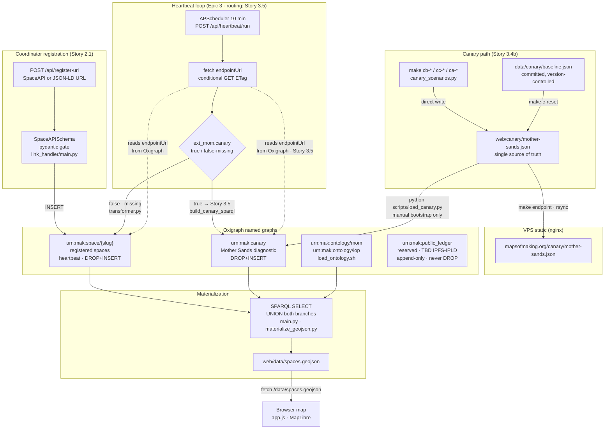

# Data Lifecycle — Maps of Making

*Redrawn 2026-05-17 (Story 3.4b clean-slate pivot). Replaces the 2026-04-26 sequence diagram.*

---

## Flow Diagram



---

## Named graphs — mutation rules

| Graph | Writer | Rule |
|---|---|---|
| `urn:mak:ontology/*` | `scripts/load_ontology.sh` | Replace on schema change only |
| `urn:mak:canary` | `scripts/load_canary.py` | DROP + INSERT (mutable, controlled) |
| `urn:mak:space/{slug}` | heartbeat `transformer.py` | DROP + INSERT each cycle |
| `urn:mak:public_ledger` | TBD (Story 3.5+) | Append-only — **never DROP** |

---

## Canary scenario cycle

```
make cb-zombie          →  writes web/canary/mother-sands.json
                        →  make endpoint (rsync to VPS)
                        →  make heartbeat (space/* loop — does NOT update urn:mak:canary)

python scripts/load_canary.py   →  syncs urn:mak:canary from served file
make c-report           →  coherence check: endpoint · heartbeat_log · Oxigraph · GeoJSON
```

> **Current state (3.4b):** The heartbeat loop processes `urn:mak:space/*` only. `urn:mak:canary` is updated manually via `load_canary.py` (bootstrap / scenario sync). Axis B and C are exercised. Axis A (endpoint reachability) is not yet live.
>
> **Intended state (Story 3.5):** The heartbeat also holds `mom:endpointUrl` for `urn:mak:canary`. On fetch, if the returned JSON contains `ext_mom.canary: true`, the heartbeat routes to `build_canary_sparql()` → `urn:mak:canary`. If false or missing, it routes to `transformer.py` → `urn:mak:space/{slug}`. This makes Axis A live and closes the coherence loop. The same routing pattern is reserved for `urn:mak:public_ledger` (different write contract — append-only, never DROP).

---

## Epic 3.5 — clean snapshot pipeline (transition state)

*Added 2026-05-19 (`sprint-change-proposal-2026-05-19.md`).*

Epic 3.5 re-architects the freshness path around the **snapshot as the unit of truth**: a
successful fetch produces one snapshot — `{JSON payload + observed_at + space UID}` — from which
every lifecycle fact is derived, never independently stamped. `observed_at` (UTC instant of a
successful fetch) is minted once and carried byte-identical to the browser, which computes
`age = now − observed_at`.

During the transition **two pipelines run side by side**:

| | Legacy pipeline | Clean snapshot pipeline |
|---|---|---|
| Serves | Registered spaces (`urn:mak:space/*`) | Mother Sands canary (`urn:mak:canary`) |
| Fetch store | `heartbeat_log.db` (noisy — derived columns) | New clean snapshot store, keyed by UID |
| Transform | `transformer.py` `_build_sparql_update` (fat) | Clean transform — copies `observed_at`, no re-stamp |
| GeoJSON | Full-payload feature | Minimal feature — geoloc + UID + `observed_at` |
| Built / owned by | Epic 3 | Story 3.6 (built), 3.7–3.10 (migration) |

Story 3.6 builds the clean pipeline canary-only, leaving the legacy path untouched (zero
regression risk). Stories 3.7–3.10 migrate registered spaces onto the clean path seam by seam
and **delete** the legacy `heartbeat_log` noise columns and transform-time stamping wholesale.
End state: one pipeline, the clean one.

---

## What is deferred

| Item | Target |
|---|---|
| Heartbeat routing on `ext_mom.canary` → `urn:mak:canary` (Axis A live) | Story 3.5 |
| Three-layer schema formalization (SpaceAPI core / mom: extended / community) | Story 3.5 |
| Heartbeat transformer rewrite on clean schema | Story 3.5 |
| EU-spaces reintroduction (20 filtered from SpaceAPI directory) | Story 3.5+ |
| GeoJSON payload-slimming for registered spaces (render-critical fields only) | Story 3.9 |
| Heartbeat routing on `ext_mom.public_ledger` → append-only write | Post-3.5 |
| `urn:mak:public_ledger` minting (IPFS-IPLD dag-json) | Epic 4+ |
| Full SpaceAPI directory (~244 spaces) | Post-pilot |
