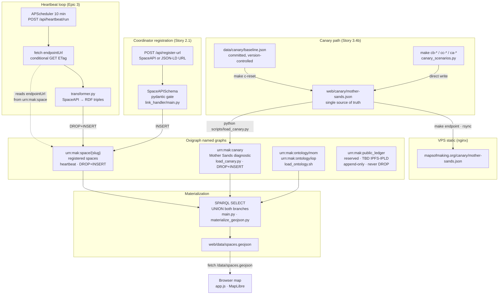

# Data Lifecycle — Maps of Making

*Redrawn 2026-05-17 (Story 3.4b clean-slate pivot). Replaces the 2026-04-26 sequence diagram.*

---

## Flow Diagram



---

## Named graphs — mutation rules

| Graph | Writer | Rule |
|---|---|---|
| `urn:mak:ontology/*` | `scripts/load_ontology.sh` | Replace on schema change only |
| `urn:mak:canary` | `scripts/load_canary.py` | DROP + INSERT (mutable, controlled) |
| `urn:mak:space/{slug}` | heartbeat `transformer.py` | DROP + INSERT each cycle |
| `urn:mak:public_ledger` | TBD (Story 3.5+) | Append-only — **never DROP** |

---

## Canary scenario cycle

```
make cb-zombie          →  writes web/canary/mother-sands.json
                        →  make endpoint (rsync to VPS)
                        →  make heartbeat (space/* loop — does NOT update urn:mak:canary)

python scripts/load_canary.py   →  syncs urn:mak:canary from served file
make c-report           →  coherence check: endpoint · heartbeat_log · Oxigraph · GeoJSON
```

> **Note:** The heartbeat loop processes `urn:mak:space/*` only. The canary graph (`urn:mak:canary`) is updated exclusively via `load_canary.py`. This is intentional — the canary is a controlled diagnostic instrument, not a live-fetched endpoint.

---

## What is deferred

| Item | Target |
|---|---|
| Three-layer schema formalization (SpaceAPI core / mom: extended / community) | Story 3.5 |
| Heartbeat transformer rewrite on clean schema | Story 3.5 |
| EU-spaces reintroduction (20 filtered from SpaceAPI directory) | Story 3.5+ |
| `urn:mak:public_ledger` minting (IPFS-IPLD dag-json) | Epic 4+ |
| Full SpaceAPI directory (~244 spaces) | Post-pilot |
