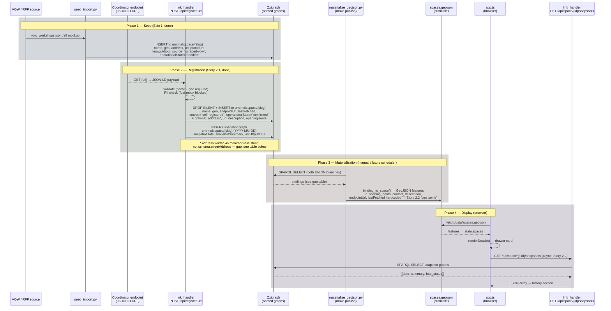

# Data Lifecycle: Seed → Registration → Storage → Display

*Design artifact — produced 2026-04-26. Informs Story 2.2 scope and admin dashboard design.*

---

## Sequence Diagram

---

## Field Mapping Table

*Columns: what field, where it comes from in JSON-LD, what predicate lands in Oxigraph, whether materialize reads it, what GeoJSON property it becomes, what the card shows, and the gap.*

| Field | Coordinator JSON-LD key | mom/schema predicate in Oxigraph | materialize reads? | GeoJSON property | Card label | Gap / Story |
|---|---|---|---|---|---|---|
| **Name** | `schema:name` | `schema:name` | ✅ | `name` | Header | — |
| **Latitude / Longitude** | `schema:geo.schema:latitude` / `longitude` | `schema:geo [schema:latitude ; schema:longitude]` | ✅ | `coordinates` | Pin position | — |
| **Street address** | `schema:address.schema:streetAddress` | `schema:streetAddress` (seed only) | ✅ (seed) | `address` | Address line | ⚠ register-url writes `mom:address` string, materialize reads `schema:streetAddress` → **confirmed spaces lose address** |
| **City / Country** | `schema:address.schema:addressLocality/Country` | `schema:addressLocality` / `schema:addressCountry` | ✅ (seed) | `city`, `country` | Address / filter | Same gap as above |
| **Website** | `schema:url` | `schema:url` | ✅ | `website` | not shown directly | — |
| **VOW profile link** | *(from VOW scrape)* | `mom:profileUrl` | ✅ → used as `endpoint_url` fallback | `endpoint_url` | Provenance URL (2.2) | — |
| **Endpoint URL** | *(req.url, not JSON-LD field)* | `mom:endpointUrl` | ❌ not yet | `endpoint_url=""` | Provenance URL empty | **Story 2.2 Task 3** |
| **Last fetched** | *(generated at write time)* | `mom:lastFetched` | ❌ not yet | `last_fetched=""` | Freshness line blank | **Story 2.2 Task 3** |
| **Error type** | *(future: set by scheduler)* | `mom:errorType` | ❌ not yet | `error_type=""` | Error banner | **Story 2.2 Task 3** (field added; value populated by Epic 3 scheduler) |
| **Operational state** | *(set by handler)* | `mom:operationalState` | ✅ | `status` | Pin colour, freshness | — |
| **Source** | *(set by handler)* | `mom:source` | ✅ | `source` | Provenance label (2.2) | — |
| **Specialties (seed)** | *(from VOW tags)* | `schema:knowsAbout` | ✅ | `specialties` | Chips | — |
| **Specialties (coordinator)** | `schema:knowsAbout` | ❌ register-url does not write | — | `specialties=[]` | Chips empty | **Epic 3** (full ingestion) |
| **Description** | `schema:description` | `schema:description` | ❌ not read | — | (not shown) | **Story 2.2 deferred note → Epic 3** |
| **Opening hours** | `schema:openingHours` | `schema:openingHours` | ❌ not read | `opening_hours=""` | Hours row blank | **Epic 3** |
| **Founded** | *(not in current spec)* | ❌ not written | — | `founded=""` | Founded row blank | **Epic 3** |
| **Capacity** | *(not in current spec)* | ❌ not written | — | `capacity=0` | Capacity row blank | **Epic 3** |
| **Contact** | *(not in current spec)* | ❌ not written | — | `contact=""` | Contact row blank | **Epic 3** |
| **Network memberships** | *(not in current spec)* | ❌ not written | — | `network_memberships=[]` | Badges blank | **Epic 3** |
| **Open for hosting** | *(not in current spec)* | ❌ not written | — | `open_for_hosting=false` | Badge blank | **Epic 3** |
| **Snapshot history** | *(generated at write time)* | `mom:snapshotDate` / `snapshotSummary` / `lastHttpStatus` | via API not GeoJSON | — | History section (2.2 AC4) | **Story 2.2 Task 1+2** |
| **Geolocation fidelity** | *(geocoder output)* | `mom:geolocationFidelity` | ✅ | `geolocationFidelity` | (internal) | — |

---

## Summary: what Story 2.2 fixes vs what is Epic 3

**Story 2.2 fixes (read-back from Oxigraph):**
- `mom:endpointUrl` → `endpoint_url` (replaces profileUrl fallback for confirmed spaces)
- `mom:lastFetched` → `last_fetched` (enables freshness line for confirmed spaces)
- `mom:errorType` → `error_type` (field added; value populated by Epic 3 scheduler)
- Snapshot named graph: written by amended register-url, queried by new snapshots API

**Confirmed address gap (not in Story 2.2 scope):**
Register-url writes `mom:address` as a flat string; materialize reads `schema:streetAddress` etc. Confirmed spaces will inherit their seeded address (the DROP SILENT + INSERT overwrites the graph, discarding seeded address triples). This needs either: (a) register-url to write structured `schema:streetAddress` triples, or (b) materialize to also read `mom:address` as fallback. → Tag for **Story 2.3 or Epic 3**.

**Everything else (opening hours, specialties from coordinator, contact, etc.):**
Requires Epic 3's periodic fetch-and-update cycle, where the scheduler re-fetches the coordinator endpoint and writes a full set of triples — not just the registration minimum.

---

## Admin Dashboard: what needs to be visible

The side-by-side view maps directly to the lifecycle columns above:

| Column | Source | What it shows |
|---|---|---|
| **Seed data** | Oxigraph seeded graph (`urn:mak:space/{slug}`) | Name, address, VOW profile URL, specialties, geo fidelity |
| **URL data** | Live fetch of `mom:endpointUrl` at query time (or last cached in snapshot) | Raw JSON-LD from coordinator endpoint |
| **Stored data** | Oxigraph confirmed graph (all predicates) | All triples for this space — what landed after ingestion |
| **Viewed data** | GeoJSON feature for this space | Exactly what the map card renders — the end result |

Gaps become visible as: field present in URL data but absent or stale in Stored / Viewed columns.

Snapshot history provides the "ingestion progress" timeline per space.
