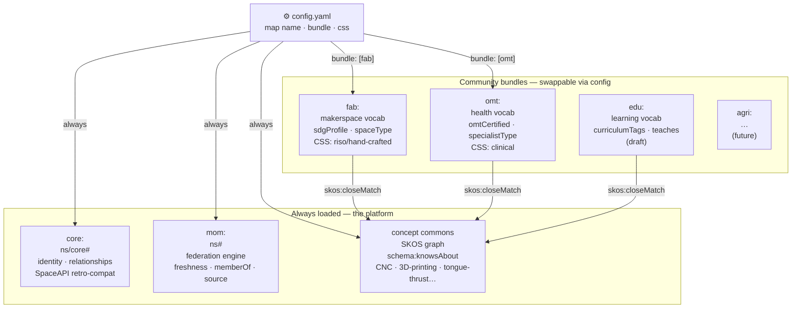
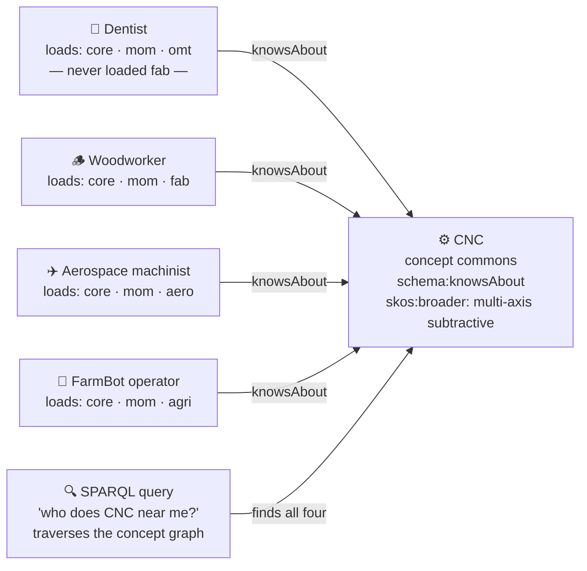

# Schema Role-Play — Personas & the Bundle Model

**Created:** 2026-05-18
**Purpose:** Validate the three-layer / four-layer schema architecture against concrete use cases *before* it is operationalized. Produced from a design dialogue around Story 3.5 (`core.ttl` + `crosswalk.csv`). This is a planning artifact — future epics (`fab.ttl` extraction, per-community bundles, managed services, emergent ontologies) inherit these personas instead of re-deriving them.

Companion to: `mom-schema-architecture-handoff.md`, Story 3.5, ADR-016.

---

## Diagrams

### The four-layer bundle model

### The wormhole — cross-silo discovery without coordination

> **No coordination required.** The dentist published `knowsAbout: CNC` in their `omt:`-only JSON. The woodworker's query finds them because the concept IRI is shared — not because either party installed the other's bundle. The wormhole opens from the *query side*. Proximity within the concept graph (dentist-CNC ≈ aerospace-CNC ✗ woodworking-CNC) is encoded via `skos:broader`/`skos:related` edges and is traversable independently of community membership.

---

## The bundle-loading model

A MOM map deployment is configured like a `docker-compose.yml`: a `config.yaml` declares the map name, the **bundle** of ontology layers to load, and a CSS style. Default bundle = `core + mom`.

### Four layers

| Layer | Namespace / file | Loaded | Role |
|---|---|---|---|
| **`core`** | `…/ns/core#` — `core.ttl` | always | Portable identity — name, logo, website, geoloc, address, `core:relationships`. The SpaceAPI retro-compat minimum every node has. |
| **`mom`** | `…/ns#` — `mom.ttl` | always (default bundle) | The federation *engine* — `operationalState`, `endpointHealth`, freshness, `memberOf`, `description`, `source`. What makes a map *live* vs. a static directory. |
| **concept commons** | currently in `mom.ttl` (`mom:ActivityScheme`); future own namespace | always (in the graph) | The SKOS concept graph that `schema:knowsAbout` resolves into — CNC, 3D-printing, tongue-thrust… Owned by nobody, traversable by everybody. |
| **community** (`fab` / `omt` / `edu` / `agri` / `culture`…) | future per-community `.ttl` | per `config.yaml` | Community vocabulary + specific fields + CSS bundle. |

### Two principles

1. **Bundles are *view* configuration; the Oxigraph graph is universal.** A community map renders its bundle by default — "Maps of Healing" shows `omt:` with a clinical CSS — but the underlying graph holds every node from every community. The view can be widened on demand.
2. **The wormhole is a backend graph traversal, surfaced only on query.** Silos (agri / health / fab / edu / culture) rarely cross. Linked-open-data lets a query cross them — an Einstein-Rosen bridge between layers — *without* either community installing the other's bundle.

### Sovereignty

Every node owns one JSON file at a URL. They choose: **self-host** it, or **mutualize hosting** with MOM as a service. Either way, one file rules all maps that read it; the publisher keeps full sovereignty over what they share. This is Solid-pod-ready by direction.

---

## The personas

| # | Persona | Bundle | Tests | Verdict |
|---|---|---|---|---|
| 1 | **Bernard's hackerspace**, self-hosted | core + mom + fab | retro-compat baseline | ✅ holds — this is the pilot today |
| 2 | **Logopède in Namur** — no idea how to host; MOM-managed | core + mom + omt, `css: clinical` | managed hosting + branded bundle ("Maps of Healing") | ✅ holds — MOM hosts the JSON at a URL it controls; heartbeat is identical to self-hosted |
| 3 | **Dentist doing CNC ceramic crowns** — loaded only `omt:`, never `fab:` | core + mom + omt | **the wormhole / emergence** | ⚠️ holds *only if* the CNC concept is a shared IRI in the concept commons — see below |
| 4 | **Materials dealer / brand** | core + mom + `supply:` | adding a 5th community without touching core/mom | ✅ holds — governance boundary works |
| 5 | **School running a repair café** | core + mom + edu + fab | multi-membership, `@type` array | ✅ holds — same pattern as the dentist |

### The decisive case — Persona 3, the dentist

The dentist **never loads `fab:`** — they are not aware of the makerspace world, and the architecture must not require them to be. Yet a woodworker's "who does CNC near me" query should still surface them.

This works because `schema:knowsAbout` is **concept-based**, and the concept lives in the shared commons *below* the community bundles. The dentist publishes `knowsAbout: <cnc-concept>`; the woodworker queries the same concept IRI. No coordination. That is "design for emergence."

**Why a graph and not flat tags:** dentist-CNC ≈ aerospace-CNC, but dentist-CNC ✗ woodworking-CNC. They share architectural constraints (multi-axis + controller + motors + bits), not community. Proximity is **graph-traversal distance** across `skos:broader` / `skos:related` edges, and those edges cross domains — FarmBot's agro-CNC sits on an edge of the same concept. A flat tag `"cnc"` cannot express this; a SKOS concept graph can.

**Conclusion that fed Story 3.5:** the wormhole is not a feature to build later — it *is* `crosswalk.csv`. Every community's specialised skill field (`fab:equipment`, `omt:treatmentFocus`, `edu:subjects`) `skos:closeMatch`-es the shared `schema:knowsAbout` hub. The column of `skos:closeMatch` rows in the crosswalk is the bridge map.

---

## The "private joke" layer — emergent community ontologies

Out of scope for Story 3.5, but this is where MOM differentiates.

A community begins with terms they invented — a *limited shared understanding*, a private joke. Ontologies for some domains exist; for many they don't. The growth pipeline:

1. A community publishes JSON with their own terms. MOM ingests **permissively** — never rejects.
2. Unrecognised terms → **`gap_log`**. The gap log is the **on-ramp for emergent ontology**, not a janitorial dump.
3. **Curation:** recurring gap terms get minted as concepts in that community's namespace — the private joke becomes a local vocabulary.
4. **Bridge discovery:** a curator (later, an LLM) notices term X in `omt:` and term Y in `fab:` mean the same thing → adds a `skos:closeMatch` → a new wormhole edge is born.
5. That `skos:closeMatch` lands in `crosswalk.csv`. **The crosswalk is a living bridge registry that grows.**

A concept has two life-stages: **local/private** and **commons/bridged**. Promotion is a curation act — and that curation, offered as a service, is MOM's second monetization lane.

### External concept anchors (candidates)

- **Wikidata** — `owl:sameAs wd:...`, already used in `mom.ttl`. General-purpose stable anchor.
- **OpenKnowHow (OKH) / IoP Alliance** — `github.com/iop-alliance/OpenKnowHow`. A hardware-documentation standard; a domain-deep anchor for the fabrication side of the commons. *Naming note:* this is **Internet of Production** — distinct from the repo's existing `ontology/iop/iop.ttl`, which is **Internet of Places**. Do not conflate.

---

## Monetization — two lanes (product-level, not schema work)

The architecture already accommodates both; neither needs new schema design:

1. **Managed hosting.** MOM hosts a community's endpoint JSON. Heartbeat fetches it identically to a self-hosted one — MOM is a reader, it doesn't care who owns the host.
2. **Managed ontology.** MOM co-develops a community's bundle: curating their `gap_log`, minting their concepts, discovering bridges. The community gets a vocabulary they could never build alone.

Communities that can self-host and self-curate (hacker/makerspaces) will; those that can't (logopèdes, dentists, therapists, smaller health networks) can delegate. Belongs in a product brief, Phase 3+.

---

## What this validated for Story 3.5

- `schema:knowsAbout` confirmed as the shared concept pivot.
- `core.ttl` → sub-namespace `…/ns/core#`; operational fields stay `mom:`.
- `crosswalk.csv` is the functional wormhole map, not documentation — v1 of a living registry.
- `gap_log` reframed as the emergence on-ramp.
- Activity/skill concepts are the **concept commons**, NOT `fab:` — must not be mis-filed during the future `fab.ttl` extraction.
