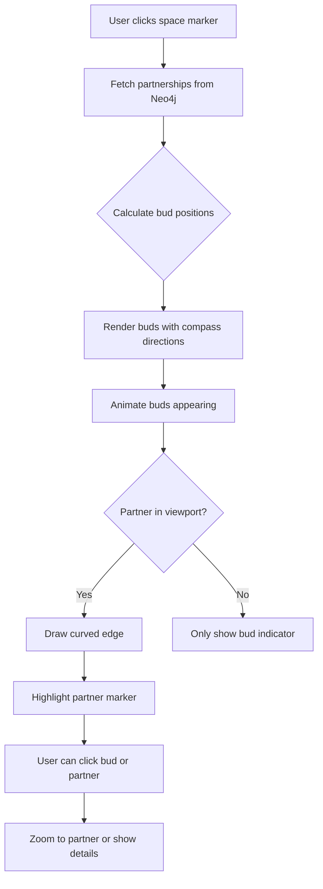

# Partnership Visualization Concept

## Overview
Explore graph-based partnership visualization combining Neo4j relationship queries with Leaflet.js multi-layer rendering to show collaborative networks between maker spaces.

## User Interaction Flow

### Zoom Level 1: Overview (Continental View)
```
User sees: Clustered space markers color-coded by freshness
├─ Green clusters: ✅ Fresh spaces
├─ Yellow clusters: ⚠️ Aging spaces
├─ Red clusters: 🧟 Zombie spaces
└─ Partnership edges: Hidden (too many to display)
```

### Zoom Level 2: Regional View (Country/State)
```
User sees: Individual space markers
├─ Markers decluster
├─ Partnership edges appear as thin lines
├─ Edge thickness = partnership strength/activity
└─ Hovering edge shows partnership type: "Skill Exchange", "Equipment Sharing"
```

### Zoom Level 3: City View (Selected Space)
```
User clicks space marker → Transformation
├─ Selected space enlarges (1.5x size)
├─ "Buds" (small circles) sprout from marker
│   ├─ Each bud represents ONE partnership
│   ├─ Bud points toward partner location (compass direction)
│   ├─ Bud color indicates partnership status:
│   │   ├─ 🟢 Green: Active partnership (<30 days activity)
│   │   ├─ 🟡 Yellow: Dormant (30-90 days)
│   │   └─ 🔴 Red: Pending/Suggested
│   └─ Bud size = partnership intensity
│
├─ Curved edges (Bezier) connect to visible partners
└─ Partners highlighted with pulsing glow effect
```

### Zoom Level 4: Neighborhood View (Partnership Network)
```
When zooming out after selecting a space:
├─ Highlighted partner spaces stay highlighted
├─ Edges "grow" visually (animated stroke-dashoffset)
├─ Network forms visible web of connections
├─ Can select multiple spaces to see overlapping networks
└─ Intersection nodes (spaces with multiple partnerships) pulse
```

---

## Technical Implementation

### Neo4j Query for Partnerships

```cypher
// Get space with partnerships and partner details
MATCH (space:Space {id: $spaceId})
OPTIONAL MATCH (space)-[p:PARTNERSHIP]->(partner:Space)
RETURN space,
       collect({
         partner: partner,
         type: p.type,
         since: p.since,
         activity_score: p.activity_score,
         direction: point.azimuth(
           point({latitude: space.lat, longitude: space.lon}),
           point({latitude: partner.lat, longitude: partner.lon})
         )
       }) as partnerships
```

### Leaflet.js Layers Architecture

```javascript
// Layer hierarchy (bottom to top)
const layers = {
  baseMap: L.tileLayer(osmTiles),              // OSM tiles
  partnershipEdges: L.layerGroup(),            // Curved lines
  spaceMarkers: L.geoJSON(spaces),             // Space icons
  partnershipBuds: L.layerGroup(),             // Bud indicators
  selectedSpaceHighlight: L.layerGroup(),      // Selected space effects
  interactionOverlay: L.layerGroup()           // Tooltips, popups
};

// Add to map with z-index control
map.addLayer(layers.baseMap);
map.addLayer(layers.partnershipEdges);
map.addLayer(layers.spaceMarkers);
map.addLayer(layers.partnershipBuds);
```

### "Buds" Implementation (SVG Markers)

```javascript
function createPartnershipBuds(space, partnerships) {
  const buds = [];
  const budRadius = 8; // Base radius in pixels
  const orbitRadius = 30; // Distance from center marker

  partnerships.forEach((p, index) => {
    // Calculate bud position using compass direction
    const angleRadians = (p.direction - 90) * Math.PI / 180;
    const offsetX = Math.cos(angleRadians) * orbitRadius;
    const offsetY = Math.sin(angleRadians) * orbitRadius;

    const budIcon = L.divIcon({
      html: `
        <div class="partnership-bud"
             style="
               width: ${budRadius * p.activity_score}px;
               height: ${budRadius * p.activity_score}px;
               background: ${getPartnershipColor(p)};
               border-radius: 50%;
               transform: translate(${offsetX}px, ${offsetY}px);
               pointer-events: auto;
             "
             data-partner-id="${p.partner.id}">
        </div>
      `,
      className: 'bud-container',
      iconSize: [0, 0]  // Parent has no size, child positioned via transform
    });

    const budMarker = L.marker([space.lat, space.lon], { icon: budIcon })
      .on('click', () => zoomToPartner(p.partner))
      .on('mouseover', () => highlightEdge(space.id, p.partner.id));

    buds.push(budMarker);
  });

  return L.layerGroup(buds);
}

function getPartnershipColor(partnership) {
  const daysSinceActivity = (Date.now() - new Date(partnership.last_activity)) / (1000 * 60 * 60 * 24);

  if (daysSinceActivity < 30) return '#22c55e';      // Green (active)
  if (daysSinceActivity < 90) return '#eab308';      // Yellow (dormant)
  return '#ef4444';                                   // Red (stale/pending)
}
```

### Curved Edges (Bezier Connections)

```javascript
// Use Leaflet.curve plugin for curved edges
function createPartnershipEdge(spaceA, spaceB, partnership) {
  const latA = spaceA.lat, lonA = spaceA.lon;
  const latB = spaceB.lat, lonB = spaceB.lon;

  // Calculate control point for curve (offset perpendicular to line)
  const midLat = (latA + latB) / 2;
  const midLon = (lonA + lonB) / 2;
  const curvature = 0.3; // Adjust for more/less curve

  const controlLat = midLat + (lonB - lonA) * curvature;
  const controlLon = midLon - (latB - latA) * curvature;

  const curve = L.curve(
    [
      'M', [latA, lonA],
      'Q', [controlLat, controlLon],
           [latB, lonB]
    ],
    {
      color: getPartnershipColor(partnership),
      weight: 2 + partnership.activity_score * 3,  // 2-5px thickness
      opacity: 0.6,
      className: 'partnership-edge',
      animate: true  // Enable growth animation
    }
  );

  curve.bindTooltip(`${partnership.type}<br>Since ${partnership.since}`);

  return curve;
}
```

### Zoom-Based Layer Visibility

```javascript
map.on('zoomend', function() {
  const zoom = map.getZoom();

  if (zoom < 8) {
    // Continental view: Hide edges, show clusters
    layers.partnershipEdges.clearLayers();
    layers.partnershipBuds.clearLayers();
  }
  else if (zoom < 12) {
    // Regional view: Show thin edges, no buds
    loadPartnershipEdges({ style: 'minimal' });
    layers.partnershipBuds.clearLayers();
  }
  else {
    // City/neighborhood view: Show buds on selected space
    if (selectedSpace) {
      loadPartnershipBuds(selectedSpace);
    }
  }
});
```

### Edge Growth Animation (CSS)

```css
.partnership-edge {
  stroke-dasharray: 1000;
  stroke-dashoffset: 1000;
  animation: growEdge 1.5s ease-out forwards;
}

@keyframes growEdge {
  to {
    stroke-dashoffset: 0;
  }
}

.partnership-edge:hover {
  stroke-width: 5px !important;
  opacity: 1 !important;
  filter: drop-shadow(0 0 8px currentColor);
}
```

### Partner Highlight Effect

```javascript
function highlightPartners(spaceId, partnerIds) {
  partnerIds.forEach(partnerId => {
    const marker = spaceMarkers[partnerId];

    // Add pulsing glow class
    marker.getElement().classList.add('partner-highlight');

    // Optional: Temporarily increase marker size
    const originalIcon = marker.getIcon();
    marker.setIcon(L.divIcon({
      ...originalIcon.options,
      html: `<div class="pulsing-marker">${originalIcon.options.html}</div>`
    }));
  });
}
```

```css
@keyframes pulse {
  0%, 100% {
    box-shadow: 0 0 0 0 rgba(34, 197, 94, 0.7);
    transform: scale(1);
  }
  50% {
    box-shadow: 0 0 0 20px rgba(34, 197, 94, 0);
    transform: scale(1.1);
  }
}

.partner-highlight {
  animation: pulse 2s infinite;
}
```

---

## Advanced Features

### 1. Multi-Space Network Selection
```javascript
let selectedSpaces = new Set();

function toggleSpaceSelection(spaceId) {
  if (selectedSpaces.has(spaceId)) {
    selectedSpaces.delete(spaceId);
  } else {
    selectedSpaces.add(spaceId);
  }

  // Re-render network showing all partnerships
  const allPartnerships = Array.from(selectedSpaces)
    .flatMap(id => getPartnerships(id));

  renderPartnershipNetwork(allPartnerships);
}
```

### 2. Partnership Type Filtering
```javascript
const partnershipFilters = {
  skillExchange: true,
  equipmentSharing: true,
  events: false,
  mentorship: true
};

function filterEdgesByType(edges) {
  return edges.filter(edge =>
    partnershipFilters[edge.partnership.type]
  );
}
```

### 3. Community Detection Overlay
```javascript
// Run Louvain algorithm in Neo4j, return community assignments
CALL gds.louvain.stream('space-partnership-graph')
YIELD nodeId, communityId
RETURN gds.util.asNode(nodeId).id AS spaceId, communityId

// Color spaces by community
function colorByCommunity(space, communityId) {
  const communityColors = [
    '#3b82f6', '#ef4444', '#22c55e', '#f59e0b',
    '#8b5cf6', '#ec4899', '#14b8a6', '#f97316'
  ];

  return communityColors[communityId % communityColors.length];
}
```

### 4. Temporal Partnership Playback
```javascript
// Slider to show partnerships over time
function animatePartnershipGrowth(startDate, endDate) {
  const timeline = createTimeSlider(startDate, endDate);

  timeline.on('change', (currentDate) => {
    // Query Neo4j for partnerships active at currentDate
    const activePartnerships = getPartnershipsAt(currentDate);

    // Update edge visibility
    layers.partnershipEdges.clearLayers();
    activePartnerships.forEach(p => {
      layers.partnershipEdges.addLayer(createPartnershipEdge(p));
    });
  });
}
```

---

## Data Flow



---

## Integration with Existing Architecture

### API Endpoint Enhancement

Add to `/home/user/maps_of_making/docs/architecture/architecture.md` API spec:

```python
# FastAPI endpoint
@app.get("/api/spaces/{space_id}/partnerships")
async def get_space_partnerships(
    space_id: str,
    include_pending: bool = False,
    min_activity_score: float = 0.0
):
    """
    Returns partnerships for a space with geometric data for visualization.

    Response includes:
    - Partner space details (lat, lon, name)
    - Partnership metadata (type, since, activity_score)
    - Geometric data (azimuth/direction from source to partner)
    - Freshness status of partner
    """
    query = """
    MATCH (space:Space {id: $space_id})
    OPTIONAL MATCH (space)-[p:PARTNERSHIP]->(partner:Space)
    WHERE p.activity_score >= $min_activity_score
      AND (p.status = 'active' OR $include_pending)
    RETURN space,
           collect({
             partner: partner {.*,
               azimuth: point.azimuth(
                 point({latitude: space.lat, longitude: space.lon}),
                 point({latitude: partner.lat, longitude: partner.lon})
               )
             },
             partnership: p {.*}
           }) as partnerships
    """
    # ... execute and return
```

### Frontend State Management (Svelte Store)

```javascript
// stores/map.js
import { writable } from 'svelte/store';

export const selectedSpaces = writable(new Set());
export const visiblePartnerships = writable([]);
export const mapZoom = writable(10);

// Reactive partnership loading
mapZoom.subscribe(zoom => {
  if (zoom > 12) {
    loadDetailedPartnerships();
  } else {
    loadMinimalPartnerships();
  }
});
```

---

## Performance Considerations

### 1. Edge Density Management
```javascript
// Limit edges rendered based on zoom and viewport
function getVisiblePartnerships(viewport, maxEdges = 500) {
  // Priority:
  // 1. Partnerships of selected spaces
  // 2. Partnerships between visible spaces
  // 3. Highest activity_score partnerships

  return prioritizedPartnerships.slice(0, maxEdges);
}
```

### 2. Canvas Rendering for Dense Networks
```javascript
// Switch to canvas for >1000 edges
if (partnerships.length > 1000) {
  useCanvasRenderer(partnerships);  // Leaflet.canvas
} else {
  useSVGRenderer(partnerships);     // Default
}
```

### 3. Clustering with Partnership Hints
```javascript
// Show cluster with partnership count badge
const cluster = L.markerClusterGroup({
  iconCreateFunction: function(cluster) {
    const spaces = cluster.getAllChildMarkers();
    const partnershipCount = spaces.reduce(
      (sum, space) => sum + space.partnerships.length, 0
    );

    return L.divIcon({
      html: `<div class="cluster-icon">
        <span class="space-count">${spaces.length}</span>
        <span class="partnership-count">${partnershipCount} links</span>
      </div>`
    });
  }
});
```

---

## User Testing Questions

1. **Bud Interaction**: Do users understand buds point toward partners?
2. **Color Meaning**: Is the freshness color scheme intuitive?
3. **Animation Speed**: Is edge growth too slow/fast?
4. **Density Threshold**: At what point do edges become overwhelming?
5. **Mobile**: How do buds work on touch devices?

---

## Next Steps

1. ✅ **Validate with prototype**: Build minimal HTML/JS demo
2. ⬜ **User testing**: Show to 3-5 maker community members
3. ⬜ **Iterate**: Adjust bud size, colors, animation timing
4. ⬜ **Integrate with Svelte**: Convert to Svelte components
5. ⬜ **Performance test**: Simulate 500+ spaces with dense partnerships

---

## References

- Leaflet.curve plugin: https://github.com/elfalem/Leaflet.curve
- Neo4j spatial functions: https://neo4j.com/docs/cypher-manual/current/functions/spatial/
- Svelte + Leaflet: https://github.com/ngyewch/svelte-leaflet
- Current architecture: `/docs/architecture/architecture.md`
- Sprint plan integration: Phase 1, Story 3.3 (Map visualization)
