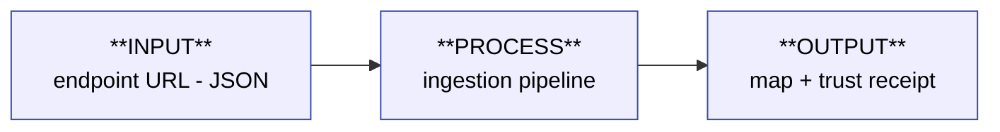

# Payload Lifecycle — the nested IPO map

> What happens to a payload, from `endpoint URL` to `pin on the map`.
>
> The structure is nested, the way a body is: one organism is a few organs, each organ is many cells. Here, one **INPUT · PROCESS · OUTPUT** opens into sub-modules that each have their own Input → Process → Output, and those open again — down to the actual functions. Same shape at every scale; you only zoom as deep as the question needs.
>
> **Rule:** every JSON field declares a *route* through this body — which module handles it, and where it ends up. A field added later (e.g. `ext_fab.*`) is documented by naming the one module that routes it and the one output it reaches.

---

## Level 0 — the whole lifecycle

That's the entire system at altitude. Everything below is a zoom.

---

## Level 1 — open each box

Each box below is itself an **I → P → O**. Click into the deepest one only when you need it.

### 📥 INPUT — _acquire a trusted payload_
| | |
|---|---|
| **In** | coordinator submits an endpoint URL |
| **Process** | register → on each tick, HTTP GET + validate + mint `observed_at` |
| **Out** | one validated payload + `content_changed` flag |

### ⚙️ PROCESS — _split into two truths_
Opens into four sub-IPO modules (Level 2):

| Sub-module | In → Out | Role |
|---|---|---|
| **P1 · Fetch & Validate** | URL → snapshot row + `content_changed` | acquire + verify |
| **P2 · Transform** | validated payload → RDF triples | semantic mapping (`spaceapi_extract`) |
| **P3 · Record (the fork)** | snapshot → **SQLite**, triples → **Oxigraph** | keep the raw record; update the semantic copy only if it changed |
| **P4 · Materialize** | Oxigraph SPARQL → `spaces.geojson` | build the renderable |

### 📤 OUTPUT — _two guarantees, two surfaces_
| Surface | Fed by | Guarantee |
|---|---|---|
| **Map pin** | Oxigraph → `spaces.geojson` | freshness (semantic, queryable) |
| **Trust receipt** | SQLite raw snapshot (on demand) | transparency (verbatim, unaltered) |

---

## Level 2 — the deepest shell (open on demand)

<b>P3 · Record — the fork mechanics</b>

- `fetch_snapshot` writes the **raw snapshot to SQLite first**, minting `observed_at` (`pipeline.py:43`, `snapshot_store.py:48`).
- Only when `content_changed=True`, the transform path writes **RDF triples to Oxigraph** via idempotent `DELETE WHERE + INSERT DATA` (`pipeline.py:255`).
- Three freshness tokens ride here: `observed_at` (SQLite only) · `updated_at` (Oxigraph) · `open_now` (derived).

<b>P4 · Materialize</b>

- `_rematerialize_geojson` runs a SPARQL SELECT over claimed spaces → `_binding_to_feature` → `web/data/spaces.geojson` (`main.py:651,737`).
- Oxigraph is the **only** source the map reads. SQLite is pulled only for `/api/space/{id}/raw` (`main.py:1065`).

---

## How a new field gets routed (the contract)

When `ext_fab.machines` arrives in the JSON later, its documentation is one row:

| Field | Enters at | Routed by | Lands in (store) | Surfaces as |
|---|---|---|---|---|
| `ext_fab.machines` | INPUT | P2 · Transform → _which sub-script?_ | Oxigraph predicate `mom:?` | map filter / Bernard card / — |

Filling that row for **every** field is the **Field Traceability Matrix** (next artifact). The nested map above is the skeleton it hangs on.

---

## Triage ledger (classify relative to the trunk)

| Component | Bucket | Note |
|---|---|---|
| `scripts/spaceapi_extract/` | 🟢 live | P2 · Transform — on the trunk |
| `seed_spaceapi.py`, `seed_bundle.py` | 🟢 live | INPUT, staged into container |
| `harness/` (Discord bot) | 🟡 dormant | Epic 6 baseline |
| `scrub_legacy_oxigraph.py` | 🔴 vestigial | confirmed — migration ran |
| `seed_transition.py` | 🔴 vestigial | back-annotated deprecated bulk-seed files (`web/data/moms_seed.json`); inputs archived, no caller. NOT the seeded→confirmed flip (that's canary/heartbeat) |
| `validate_crosswalk.py` | 🟢 live | DRC for the net-list — runs green, guards crosswalk integrity |

_🟢 on trunk · 🟡 parked ahead of need · 🔴 purpose lost · ❓ needs your intent_
